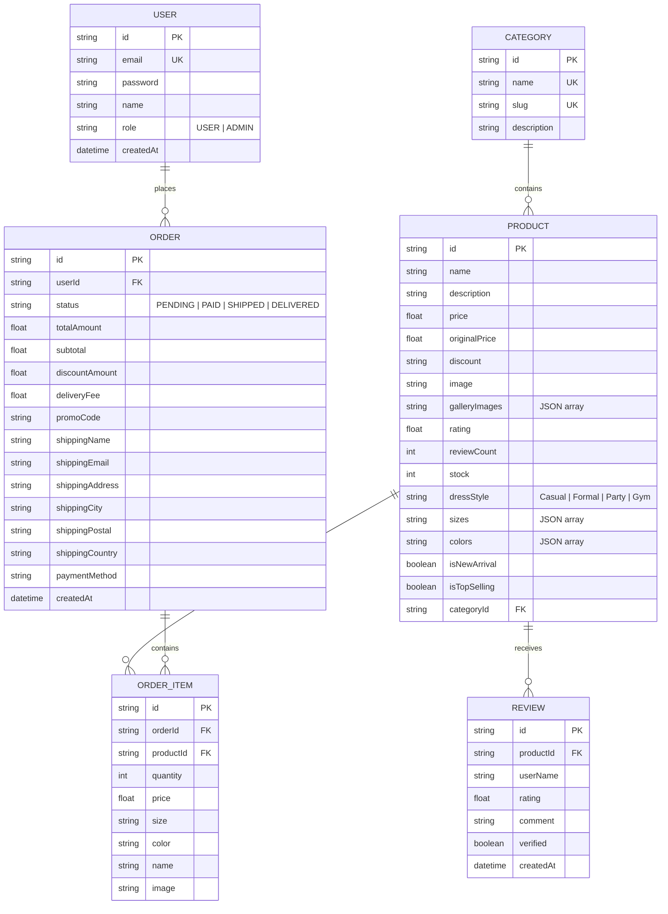

# 🛍️ ZENVIA — Modern Full-Stack E-Commerce Platform

[](https://nextjs.org/)
[](https://react.dev/)
[](https://www.typescriptlang.org/)
[](https://tailwindcss.com/)
[](https://www.postgresql.org/)
[](https://www.docker.com/)
[](https://www.prisma.io/)
[](https://authjs.dev/)

> A full-featured, pixel-perfect modern fashion storefront and administrative management system built with Next.js 16 (App Router), React 19, TypeScript, Tailwind CSS v4, and Dockerized PostgreSQL.

---

## 🌟 Key Feature Highlights

### 🛍️ 1. Storefront & Product Discovery
* **Dynamic Homepage:** Hero showcase, brand ticker (Versace, Zara, Gucci, Prada, Calvin Klein), dynamic New Arrivals, Top Selling carousels, and Dress Style category navigation.
* **Figma-Accurate Product Detail Page:**
  * Interactive 3-image vertical thumbnail gallery with live preview switching.
  * Selectable color swatches with active checkmark indicators.
  * Size selector pills (`Small`, `Medium`, `Large`, `X-Large`).
  * Quantity counter stepper (`[-] [ 1 ] [+]`).
  * Interactive tabs: *Product Details*, *Rating & Reviews*, and *FAQs*.
  * Verified customer review cards with star ratings and timestamps.
  * **"Write a Review" Modal:** Allows shoppers to submit star ratings and comments that save directly to PostgreSQL and dynamically recalculate product rating averages.
  * "You Might Also Like" related product recommendations.
* **Advanced Shop / Catalog Page (`/shop`):**
  * Multi-dimensional filtering by Category, Price Slider (`$50 - $400`), Color swatches, Sizes, and Dress Style (`Casual`, `Formal`, `Party`, `Gym`).
  * Instant keyword search bar.
  * Real-time sorting (*Most Popular*, *Price: Low to High*, *Price: High to Low*, *Newest*).
  * Responsive Mobile Filter Drawer matching the Figma mobile specification.
  * Full server-side pagination.

### 🛒 2. Cart, Checkout & Orders
* **Global Cart State:** Built with React Context and `localStorage` persistence.
* **Header Cart Sheet & Full Cart Page (`/cart`):**
  * Quick-access slide-out cart drawer + dedicated full `/cart` page.
  * Item quantity stepper, size/color labels, and instant removal.
  * **Promo Code Engine:** Apply valid discount codes like `SAVE20` (20% off), `ZENVIA10` (10% off), or `FREESHIP` (Free delivery).
* **Simulated 256-Bit Checkout:**
  * Shipping address collection and payment method selection (Credit Card, Apple Pay, PayPal).
  * Next.js Server Action that deducts stock and records the purchase in PostgreSQL.
* **Order Confirmation Receipt (`/order/success/[id]`):**
  * Interactive delivery progress timeline (`Confirmed` ➔ `Processing` ➔ `Shipped` ➔ `Delivered`).
  * Itemized receipt with price breakdowns and delivery estimates.

### 🔐 3. Administrative Control Center (`/admin`)
* **Protected Routes:** Secured via Auth.js (NextAuth) session checks with automatic login redirection.
* **Real-time Analytics Dashboard:**
  * Total Revenue, Total Orders, Average Order Value, and Inventory counts.
  * Recent customer orders list and top-performing products.
* **Product Catalog Manager (`/admin/products`):**
  * **"Add New Product" Modal:** Create products with custom categories, pricing, discounts, stock, dress styles, and images.
  * Delete product actions and live inventory status badges.
* **Order Workflow Management (`/admin/orders`):**
  * Live status changer dropdown (`PENDING` ➔ `PAID` ➔ `SHIPPED` ➔ `DELIVERED` ➔ `CANCELLED`).
  * Customer shipping details and item breakdown.

### ❤️ 4. Customer Polish & UX
* **Wishlist System:** Save favorite items to a persistent Wishlist with header badge counts.
* **Toast Notifications:** Instant visual feedback powered by `sonner`.
* **Skeleton Loading:** Seamless loading state animations across all routes.
* **Branded 404 Page:** Custom not-found error handling.

---

## 🏛️ Database Architecture & Entity Relationship Diagram (ERD)



---

## 🚀 Quickstart Guide (Run Locally in 60 Seconds)

### 1. Prerequisites
Ensure you have **Node.js (v20+)** and **Docker** installed and running on your machine.

### 2. Clone the Repository
```bash
git clone https://github.com/your-username/zenvia.git
cd zenvia
```

### 3. Start the PostgreSQL Container
```bash
docker compose up -d
```

### 4. Install Dependencies
```bash
npm install
```

### 5. Sync Database & Seed 20+ Products
```bash
npx prisma db push
npx tsx prisma/seed.ts
```

### 6. Start the Development Server
```bash
npm run dev
```
Open [http://localhost:3000](http://localhost:3000) in your browser.

---

## 🔑 Demo Access Credentials

| Role | Email | Password | Access URL |
| :--- | :--- | :--- | :--- |
| **Store Administrator** | `admin@zenvia.com` | `password` | [http://localhost:3000/login](http://localhost:3000/login) ➔ `/admin` |
| **Demo Customer** | `sarah.miller@example.com` | `password` | [http://localhost:3000/](http://localhost:3000/) |

---

## 📂 Project Directory Structure

```text
├── app/
│   ├── actions.ts              # Next.js Server Actions (Checkout, Reviews, Product CRUD)
│   ├── admin/                  # Protected Admin Panel
│   │   ├── layout.tsx          # Authenticated Sidebar Layout
│   │   ├── page.tsx            # Dashboard & Metrics Overview
│   │   ├── products/page.tsx   # Product Catalog Table & CRUD
│   │   └── orders/page.tsx     # Order Management & Status Workflow
│   ├── api/auth/[...nextauth]/ # Auth.js API route handlers
│   ├── cart/page.tsx           # Dedicated Figma Cart Page
│   ├── shop/page.tsx           # Multi-filter Catalog Page
│   ├── product/[id]/page.tsx   # Dynamic Product Details Page
│   ├── wishlist/page.tsx       # Saved Favorites Page
│   ├── order/success/[id]/     # Order Confirmation Receipt Page
│   ├── login/page.tsx          # Admin & Customer Login Page
│   ├── layout.tsx              # Root Layout & Provider Contexts
│   ├── loading.tsx             # Root Skeleton Loader
│   └── not-found.tsx           # Custom 404 Page
├── components/
│   ├── cart-provider.tsx       # Global Shopping Cart State
│   ├── wishlist-provider.tsx   # Global Wishlist State
│   ├── cart-sheet.tsx          # Header Slide-Out Cart Sheet
│   ├── product-card.tsx        # Reusable Product Card with Ratings
│   ├── product/                # Product Page Interactive Components
│   ├── shop/                   # Catalog Filter Sidebar & Mobile Drawer
│   ├── cart/                   # Cart View & Checkout Dialog
│   ├── admin/                  # Admin Modals & Status Selectors
│   ├── site/                   # Header, Footer, Brand Constants
│   └── ui/                     # Accessible Base UI / shadcn Components
├── prisma/
│   ├── schema.prisma           # Relational PostgreSQL Schema
│   └── seed.ts                 # Seeder with 20+ rich products & reviews
├── public/                     # High-resolution Figma imagery assets
├── docker-compose.yml          # PostgreSQL 15 Docker container spec
└── README.md                   # Project documentation
```

---

## 📜 License
This project is open-source under the [MIT License](LICENSE).
